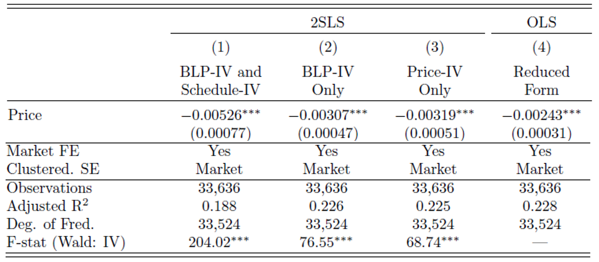

class: title-slide center

background-image: url(slide_files/EPA_seal.png), url(slide_files/NCEE_seal.png)
background-position: 35% 95%, 61% 93%
background-size: 10%, 20%

 
 
<h1>A Recreation Demand Model for Mountain Snowpack</h1>
<html>

</html>
 
 
<h2>Bryan Parthum   U.S. EPA, National Center for Environmental Economics   `r format(Sys.time(), '%B %d, %Y')`</h2>

---

class: remark-slide

<h1>Motivation</h1>

<h2>What is the <bf>marginal willingness to pay</bf> for an inch of snowpack?</h2>

  - Mountain snowpack is a large driver of outdoor recreation and mountain tourism ($80B+)
  
  - Classic nonmarket good, provided seasonally by weather and climate
  
  - Threatened by climate change
  
  - We estimate MWTP **between $1.5 to $4** per inch of snowpack

--

count: false

<h2>Why would more snow matter?</h2>

  - Snowpack covers the bare ground, allowing outdoor enthusiasts to tour, ski, glide, shred, and, most importantly, extract pillows of consumer surplus
  
     - def: "mountain snowpack" - the amount of packed snow on the ground at a resort

---

<h1>Motivation Part 2</h1>

<h2>How do recreationists choose to <bf>substitute</bf> across resort markets?</h2>

  - Site substitution is an important phenomenon in recreation demand models

  - Long history of using variation across sites to identify demand parameters

  - Few papers that explore this in the context of winter recreation/skiing

  - Climate change affects sites differently

  - We find that **while skiers are more likely to substitute across markets within their own region, even markets that are geographically distant rely on the environmental amenities in the far away markets**

     - e.g, Vermont skiers are likely to travel to Colorado when snowpack is bad, but Colorado skiers are more likely to visit Utah or California
     
---

<h1>Data</h1>

.center[]

---

<h1>Why Daily Data Matters</h1>

.center[]

---

<h1>Why Daily Data Matters</h1>

.center[]

---

<h1>Why Daily Data Matters</h1>

.center[]

---

<h1>Resorts and Short Term Rentals</h1>

.pull-left[.center[]]
.pull-right[.center[]]

---

<h1>The Model</h1>

- The utility $U$ of person $i$ from choosing alternative $j$ on day $t$ at resort $r$ is:
$$U^i_{jt} = \delta_j + \bf{\beta^\prime} snowpack_{rt} + \bf{X^\prime}_{rt} \bf{\phi} + \Omega_{t} + \theta_{r} + \varepsilon_{jt}$$
where 
$$\delta_{j} = -\lambda price_{j} + \bf{Z^\prime}_{j} \bf{\gamma} + \xi_{j}$$
   - $\delta_j(p_j,\bf{Z}_{j},\xi_j)$ alternative specific constant, $(33,636 \times 1)$ vector
   - $X$ is vector of lots of other daily stuff (# of props, new snowfall, daily weather, etc.)
   - $Z$ vector of information about alternative $j$
   - $\Omega$ day-of-sample FE
   - $\theta$ resort FE

<!-- - Standard Logit choice probabilities -->

<!-- $$P^i_{jt}= \dfrac{1}{1+exp(-U^i_{jt})}$$ -->

---

<h1>The Endogenous Price of a Trip - 2SLS</h1>

- $\delta$ (the ASC from the previous regression) of property $j$:
$$\delta_{j} = -\lambda price_{j} + \bf{Z^\prime}_{j} \bf{\gamma} + \xi_{j}$$
where
$$price_{j}= \bf{Z^\prime}_{k}\Pi_{1} + \Pi_{2}\Upsilon_{j} + \bf{Z^\prime}_{j}\Gamma + \theta_{r} + \upsilon_j$$
   - $Z_k$: BLP-IV, average price and property characteristics of $k\ne j$
   - $\Upsilon$: Schedule-IV, property owner's share of blocked days
      - ratio of blocked days to the total observed days
   - $\theta$ resort FE
   
**The assumption here is that the owner has their own schedule and does not choose to block or unblock their listing according to daily shocks in demand.** Any deviation from this assumption and the instrument will have a weak first-stage.
   
---

<h1>Results - 2SLS</h1>

- Schedule-IV (ratio of blocked days to observed days) provides strongest instrument _and_ the largest $\lambda$, resulting in lower MWTP than other IVs

.center[]

---

<h1>Results - MWTP</h1>

- Ratio of marginal utilities $MWTP=\beta/\lambda$

.center[]

---

<h1>Results - MWTP Binned Snowpack</h1>

.center[]

---

<h1>Market-level Estimation</h1>

- Estimation is carried out numerically using the contraction mapping algorithm of BLP (1995)
- Predict the market shares $s$ in state $j$ on day $t$ such that:
$$s_{jt}= \dfrac{exp(\omega_{jt})}{1+\sum_{j} exp(\omega_{jt})} \text{ ; } \eta_{jkt} = \dfrac{\partial s_{jt}}{\partial x_{k}} \dfrac{x_{k}}{s_{j}}$$

.center[]

---

<h1>Results - Market Share Elasticities</h1>

.center[]

---

<h1>Takeaways</h1>

   - Model the utility from outdoor winter recreation in a flexible discrete choice setting.

   - Skiers value and respond to **marginal changes** in mountain snowpack.

   - This means that considering welfare on the **intensive margin** will be important for estimating damages under a changing climate.

   - Estimates that use only measures of surplus on the **extensive margin** may over-predict changes in welfare by assuming that people will not substitute across markets, and under-predict changes in welfare by failing to account for changes in value on the intensive margin.

---

class: title-slide center

background-image: url(slide_files/EPA_seal.png), url(slide_files/NCEE_seal.png)
background-position: 35% 95%, 61% 93%
background-size: 10%, 20%

.pull-60[
.font140[
<b>Thank you!</b>
<html>

</html>

Questions?
]
]
.font120[Bryan Parthum]

