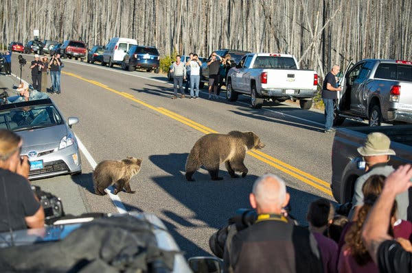
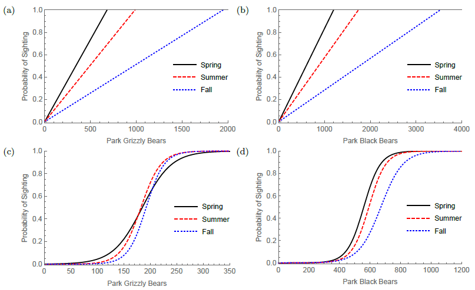
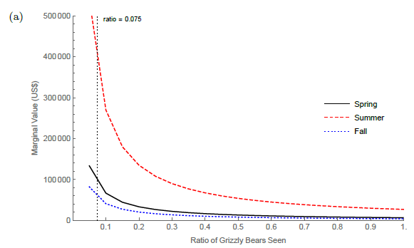

class: title-slide center

background-image: url(slide_files/EPA_seal.png), url(slide_files/NCEE_seal.png)
background-position: 35% 95%, 61% 93%
background-size: 10%, 20%

 
 
<h1>The economic value of wildlife tourism and implications of marginal population changes - Richardson and Enriquez</h1>
<html>

</html>
 
 
<h2>Bryan Parthum   U.S. EPA, National Center for Environmental Economics   `r format(Sys.time(), '%B %d, %Y')`</h2>

---

class: remark-slide

<h1>Discussion</h1>

<h2>What is the <bf>value</bf> of seeing a Yellowstone bear?</h2>

  - Wildlife viewing is a large driver of outdoor tourism
  
  - Wildlife managers often evaluate benefits of these species from an ecological perspective
  
     - But nonmarket benefits to humans matter too!
     
        - $12-38k annual viewing benefits from each black/brown bear
    
        - But potentially much much more! ($200k+)

---

<h1>Interesting Bits</h1>

<h2>Bear-jams!</h2>

- Count _only_ time spent viewing a bear

   - Analogous to rec fish literature correcting for catch-rates

.center[]

---

<h1>Interesting Bits</h1>

<h2>Probability of seeing a bear</h2>

- Where does the ecologically optimal number fall on this? 

.center[]

---

<h1>Interesting Bits</h1>

<h2>The Marginal Yogi</h2>

- Most sightings are of the habituated bears (5-10% of population)

- Low cost ways to increase probability of seeing a bear?

.center[]

---

<h1>Additional Thoughts</h1>

- Did the survey include previous bear sightings? Include in summary stats.

- Lifetime of a bear? (total "value" of a bear)

- Value of time 
   - show sensitivities around these (necessary) assumptions
   - e.g., Mileage costs, wage rate, souvenirs, etc.

- Record date you accessed BLS Tables 1.1.9 (they revise each quarter including past estimates) and include inflator in footnote

- Are benefits increasing in sightings, ecological biodiversity, and provide management through hunting?

- Bear Country USA (South Dakota) charges $60 per vehicle, (\$18 per adult). A market for bears!
