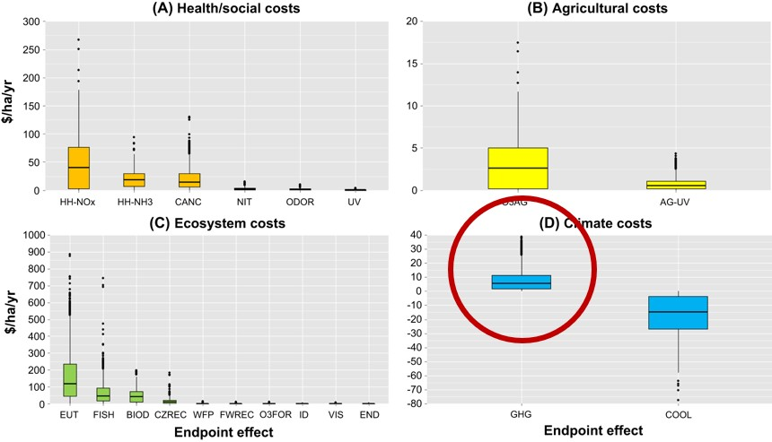
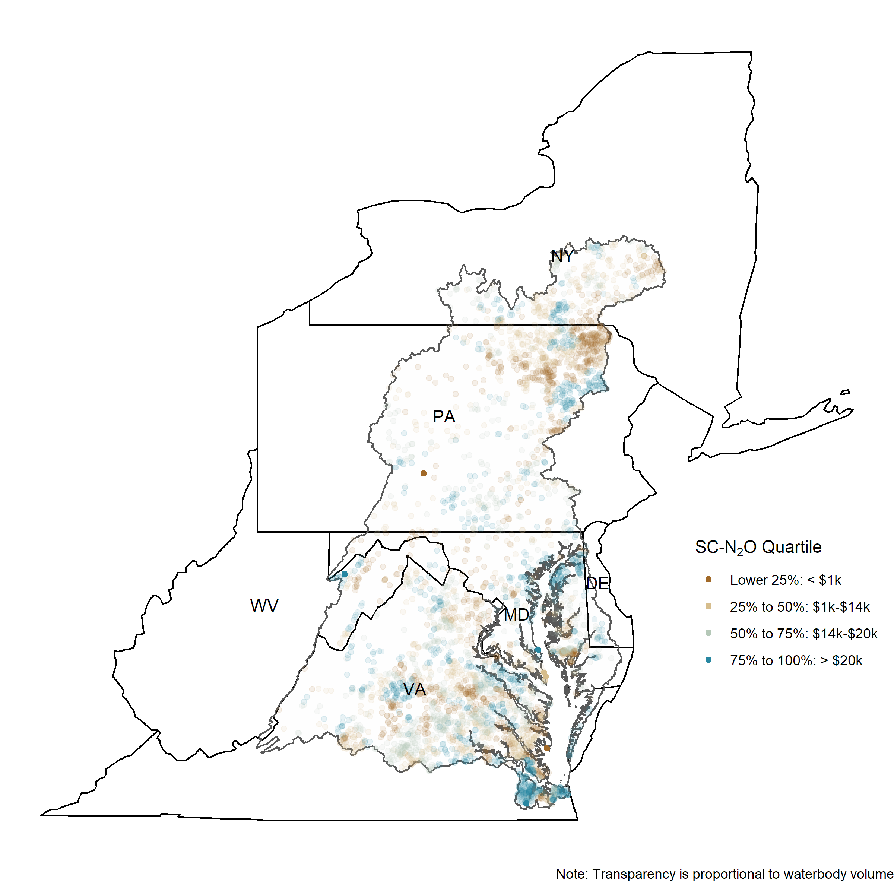
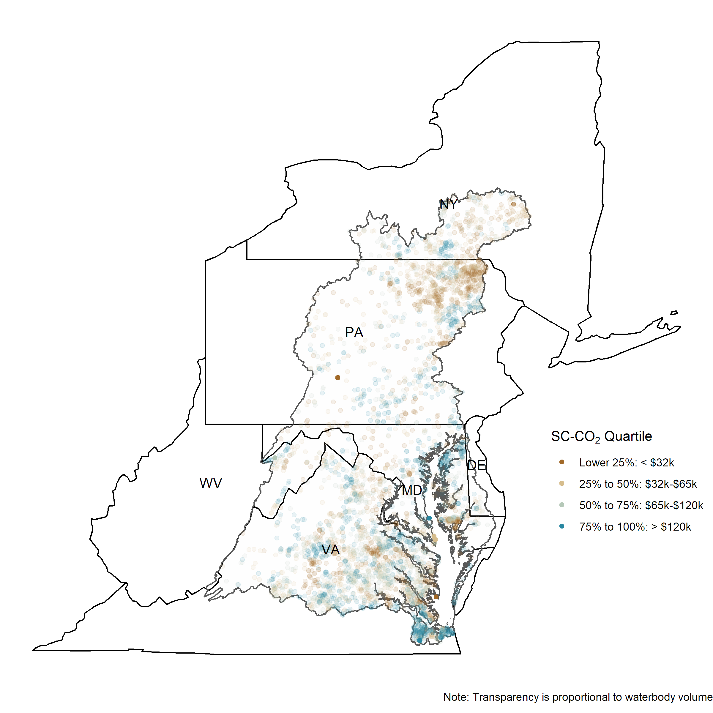
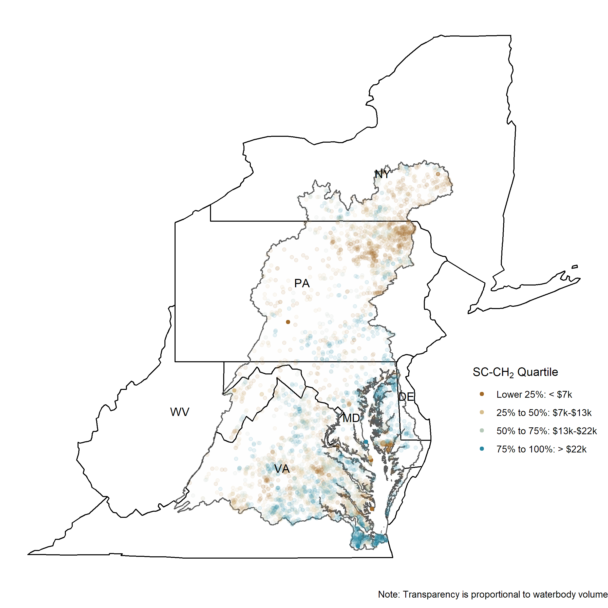

class: title-slide center

background-image: url(slide_files/EPA_seal.png), url(slide_files/NCEE_seal.png)
background-position: 65% 90%, 91% 88%
background-size: 10%, 20%

 
 
<h1>Beyond Nitrates: N to N2O and other Greenhouse Gases</h1>
<html>

</html>
 
 
<h2>Bryan Parthum   U.S. EPA, National Center for Environmental Economics   `r format(Sys.time(), '%B %d, %Y')`</h2>

 
.left[The views expressed during this presentation are those of the   presenter and do not necessarily represent those of the U.S. EPA.]

---

class: remark-slide

<h1>Additional missing or unaccounted for benefits</h1>

<h2>Nutrient management BCAs typically focus on water-related benefits</h2>

  - These are often direct, observable, and realized in the short-run (this century)
      - e.g., nonmarket: recreation and captured in housing prices; or market-based, comercial fishing, water treatment costs, etc.)
  
  - However, there are secondary effects of excess nutrient concentrations (eutrophication) that can generate large social costs
  
  - Nutrients in surface waters *at any concentration* can lead to off-gassing and contribute to greenhouse gas concentrations in the atmosphere (approx. 1% to 10%)</h2>

  - Greenhouse gases have large, *global* consequences
  
<!-- <bf>marginal willingness to pay</bf> -->
<!-- snow  -->

---

<h1>Water pollution to air pollution and its valuation</h1>

  - [van Grinsven et al. (2013)](https://pubs.acs.org/doi/abs/10.1021/es303804g), [Sobota et al (2015)](https://iopscience.iop.org/article/10.1088/1748-9326/10/2/025006/meta)
  
.center[]

  - $13.52 (&#36;5.15, &#36;21.89) per Kg of N released 
  
  - [Downing et al. (2021)](https://www.nature.com/articles/s41467-021-22836-3) did something similar with Methane (CH4), estimating &#36;7.5 to &#36;81 trillion in global climate-related damages from human nutrient enrichment 

---

<h1>Linking nutrient management policies to SC-GHGs</h1>

A Case Study of the Total Maximum Daily Loads in the Chesapeake Bay Watershed
  - Jake Beaulieu, Elizabeth Kopits, Chris Moore, Bryan Parthum
  
 

  - Early estimates of &#36;8 to &#36;32 million per year in climate benefits from the TMDL (2010)

---

class: title-slide center

background-image: url(slide_files/EPA_seal.png), url(slide_files/NCEE_seal.png)
background-position: 35% 95%, 61% 93%
background-size: 10%, 20%

.pull-60[
.font140[
<b>Thank you!</b>
<html>

</html>

Questions?
]
]
.font120[Bryan Parthum]

